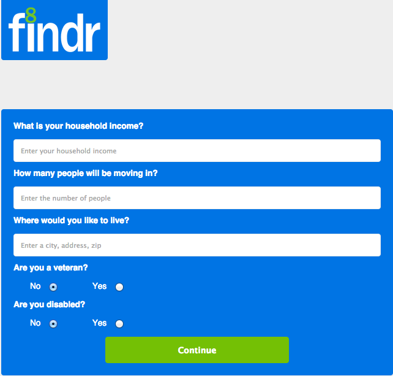
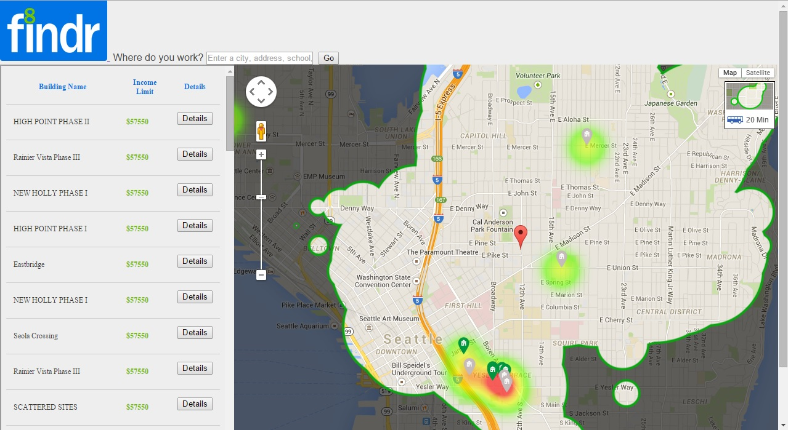

# FINDR (Find your '8')
A single service that enlightens low income renters of renting assistance options and searches for affordable homes within transit time and neighborhood safety constraints.

This webservice was developed as part of the weekend (Feb 6 '15 - Feb 8 '15) hackathon 'Hack Housing' sponsored by Zillow, UW & HUD.

## Challenge and Approach

Our submission is for [lower-income renters].

Our approach for satisfying this challenge was to:

- Identify issues that lower-income	face when searching for new homes to lease
- Look at relevant programs, APIs and data to come up with solution candidates.
- Pick the best candidate and implement the technical solution. 

Once we did that, we knew we were guaranteed to win!

## Team Members

Our team is comprised of:

- [@pnapieralski](http://github.com/pnapieralski) - Local wizard
- [@proelite](http://github.com/proelite) - Local professional troll
- [@tarasaur](http://github.com/tarasaur) - Local prehistoric lizard
- [@kr0y](http://github.com/kr0y) - Local gossiper
- [@vijay267](http://github.com/vijay267) - Local class clown

## Technologies, APIs, and Datasets Utilized

We made use of:

Rental Data and Filters

Fair Market Rents For The Section 8 Housing Assistance Payments Program: 

	HUD Location Affordability Data

	HUD Public Housing Buildings (Occupied/Unoccupied listings)

	HUD Income Limit Data

	Housing Authority Websites

Address to Geographical Location:

	Google Geocode/Reverse Geocode APIs

Transit Time Data: 

	General Transit Feed Specification (GTFS)

	Google Map APIs

	WalkScore TravelTime Widget & JS API

Local crime data: 

	data.seattle.gov

School district data:

	GreatSchools

## Contributing

In order to build and run our app:

1. Install xamp
2. Clone repository in root folder of the local host 
3. Goto http://localhost to check the state of your xamp server
4. Run http://localhost/setup-db.php
5. View homepage
6. Profit

Our code is licensed under the [MIT License](LICENSE.md). Pull requests will be accepted to this repo, pending review and approval.
